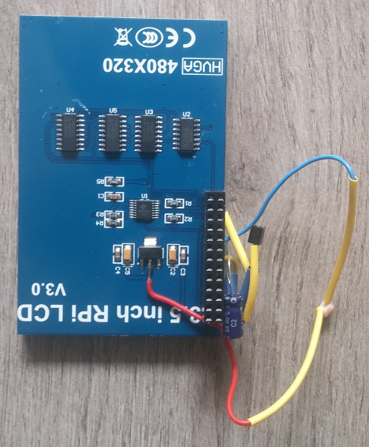
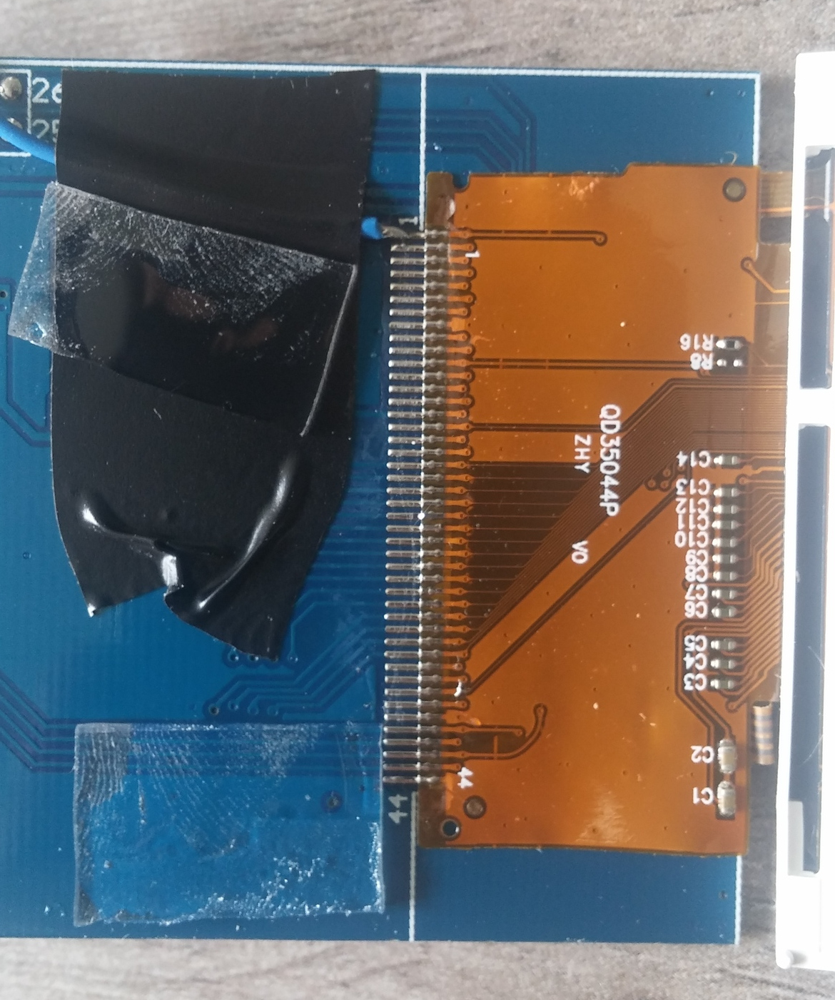
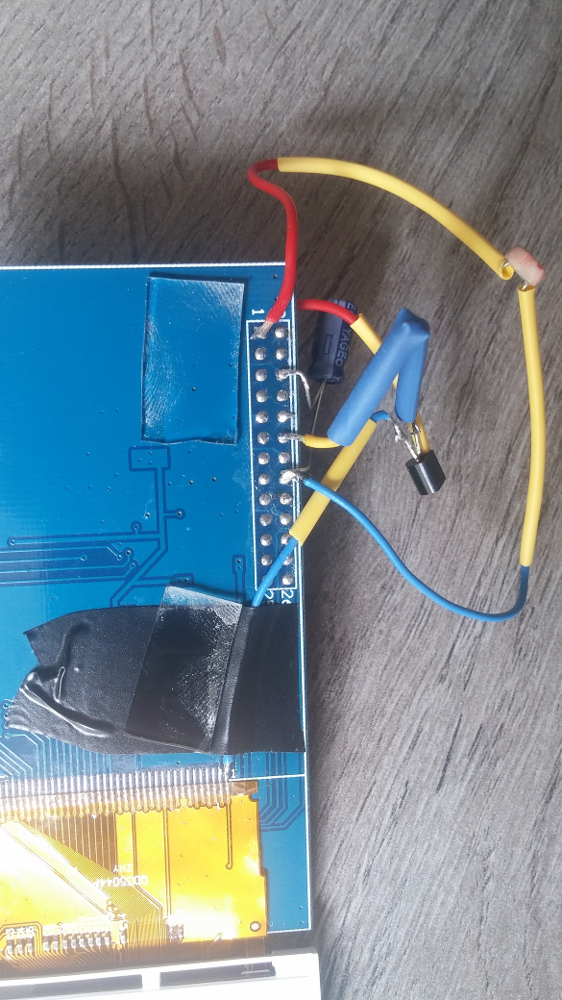
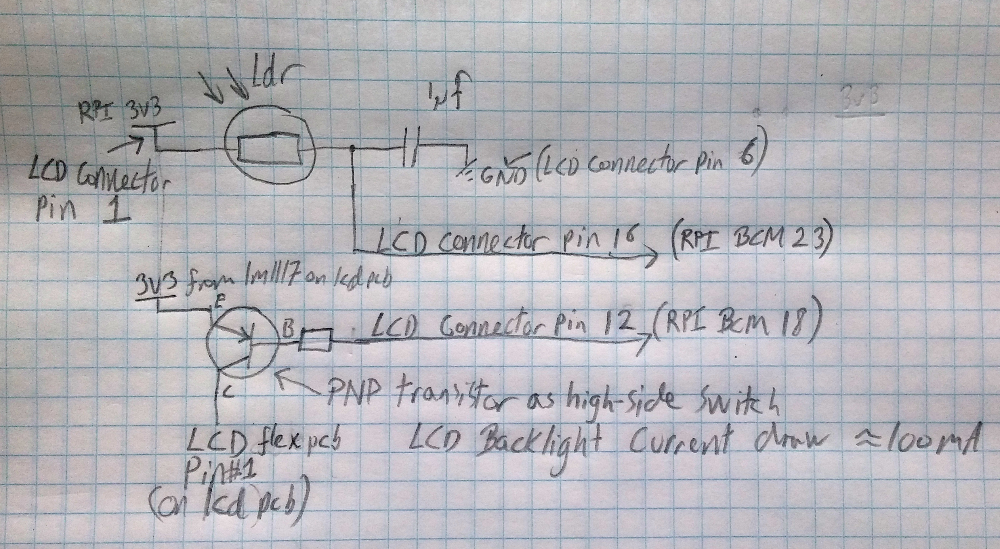

# meteogrammer
Gets meteogram from yr, and crops it with imagemagick. End goal is to hang a selfupdating pictureframe on the wall.

## Updating the meteogram
can be done by running the script:
<pre><code>
./refreshMeteogram.sh
</code></pre>

This is also where the image is cropped and resized to fit the desired screen size. If 320*480 doesn't work for you, you'll have to play around a bit.

It would be the responsibility of the user to update the meteogram image periodically by running the *refreshMeteogram.sh* command in an appropriate location.
Here's a crontab that runs it every 15 minutes:
<pre><code>
*/15 * * * * /home/pi/meteogrammer/refreshMeteogram.sh > /home/pi/meteogrammer/cron.log
</code></pre>

## Viewing the meteogram
The command:
<pre><code>feh --reload 10 --fullscreen meteogram.png
</code></pre>
Will launch a viewer that auto reloads the image every 10 seconds.. which is probably a totally overkill interval..

*showMeteogram.sh* contains the command i use to display the meteogram on my [3.5inch RPI LCD](http://www.waveshare.com/wiki/3.5inch_RPi_LCD_(A)):
<pre><code>
fbi -T 2 -d /dev/fb1 -noverbose -t 300 /home/pi/meteogrammer/*.png -cachemem 0
</code></pre>

Even though you ask fbi nicely to not cache anything, it still will, unless the slideshow consists of at least 3 images.
This is worked around by creating 2 symlinks to the meteogram.png as detailed by Jamie Jackson (who also gives more details about the above fbi command) [here](http://blog.jacobean.net/?p=941)

## Display hack
I found a 3.5 inch waveshare RaspberryPi LCD on aliexpress, but the backlight was tremendously on at all times, so the meteogram pictureframe was blinding at night.

I decided to look into modifying the LCD module to control the backlight. I found [this](https://www.raspberrypi.org/forums/viewtopic.php?t=149887&p=985245) on the raspberryPi forums which looked promising but left out a couple of details.

Luckily i found [the schematic](./docs/3.5inch-RPi-LCD-A-Schematic.pdf) for the LCD on the [waveshare wiki](http://www.waveshare.com/wiki/3.5inch_RPi_LCD_(A)) and was able to modify the board with a high side switch on the backlight controlled via PWM from the pi.

The *brightness.py* script reads a value from a light sensitive resistor (by measuring the charge time of a 1µF capacitor) and sets a corresponding duty cycle for the PWM output

###Pictures:

Here's a look at the back of the LCD module. Notice the lm 1117 which generates the 3.3V which *used to be* hardwired to the LCD backlight anode, the middle pin is now connected to the emittor of the PNP transistor:

Here's where i cut the trace to the LCD backlight common anode (pin 1 on the flex connector on the LCD module) and soldered a wire to the collector of the PNP transistor (you can't actually see the cut. It's directly underneath the blue wire) :

Here's a closeup of the side of the LCD module PCB which is under the display:

##Schematic of the modifications
Here's a hand drawn schematic of the modifications i've made:

The base resistor can be calculated from the hFE of your chosen transistor and the backlight current which i have measured to be ~100mA.
